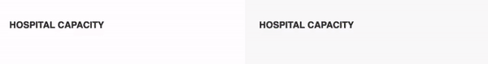
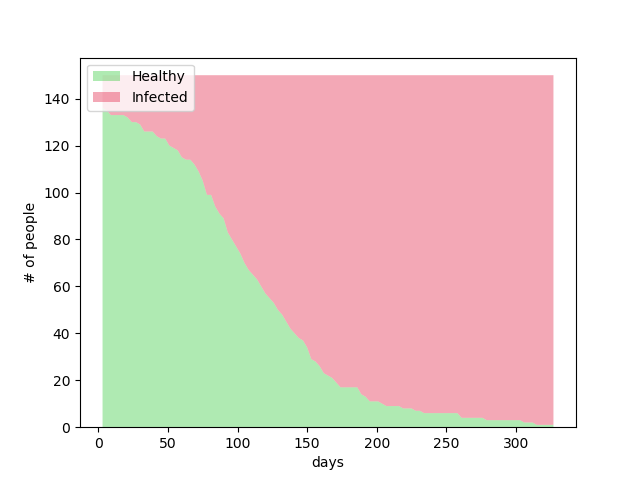
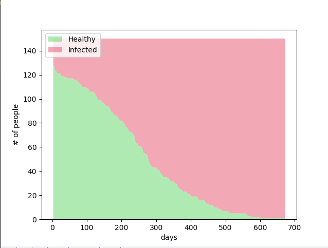

# socialDistanceSim
A simulation of how Social Distancing "Flattens the Curve"

**The Basics**  

Flattening the curve does not mean that you will have less total infected. However, the RATE at which the population gets
infected is lower. This ensures that hospitals will not be over-capacity and that there is time for a vaccine to be developed.

My take on the "Flatten the Curve" simulation trend is a closed-system physics-based simulation.
People are represented as circles and bounce around the screen.
The intial amount of infected people is quite small. However, if an infected person has a collision with
a healthy person then the infection is spread.

My simulation has a "social distancing ratio" which is the percentage of people who are staying at home, they are represented
as stationary circles with no velocity.

**LOW Social Distancing Ratio** (lots of people disregarding social distancing

**HIGH Social Distancing Ratio** (majority of people taking social distancing seriously)

As you can see, the time it takes for a closed-system simulation on just 10% social distancing to reach 100% infection 
is just under 300 days. Meanwhile the 70% social distancing ratio took around 1000 days.

An inverse relationship between entropy in the system and infection rate is the reason social distancing is effective.

**10% Social Distancing Ratio Graph**

**70% Social Distancing Ratio Graph**

This has been a real blast to develop. Remember to wash your hands and stay at home!
